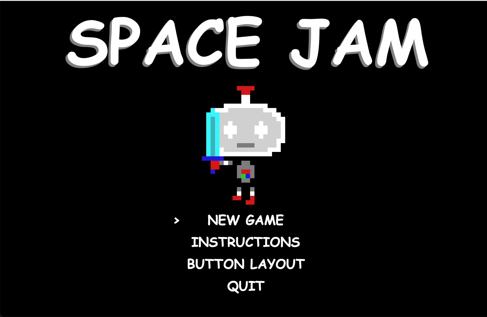
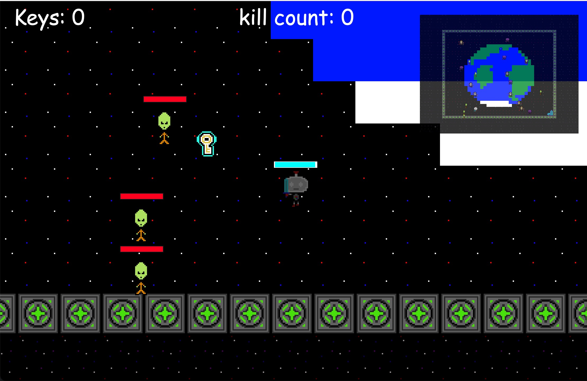
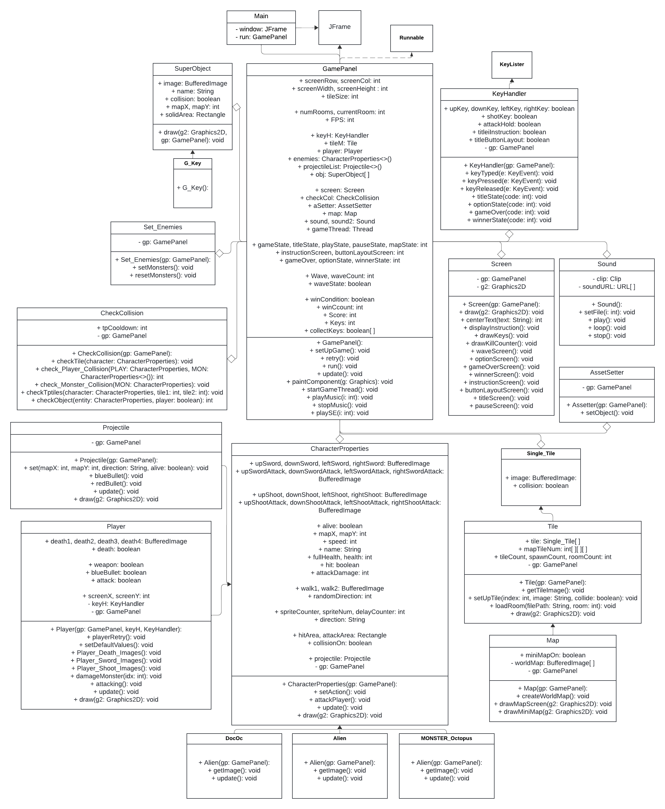
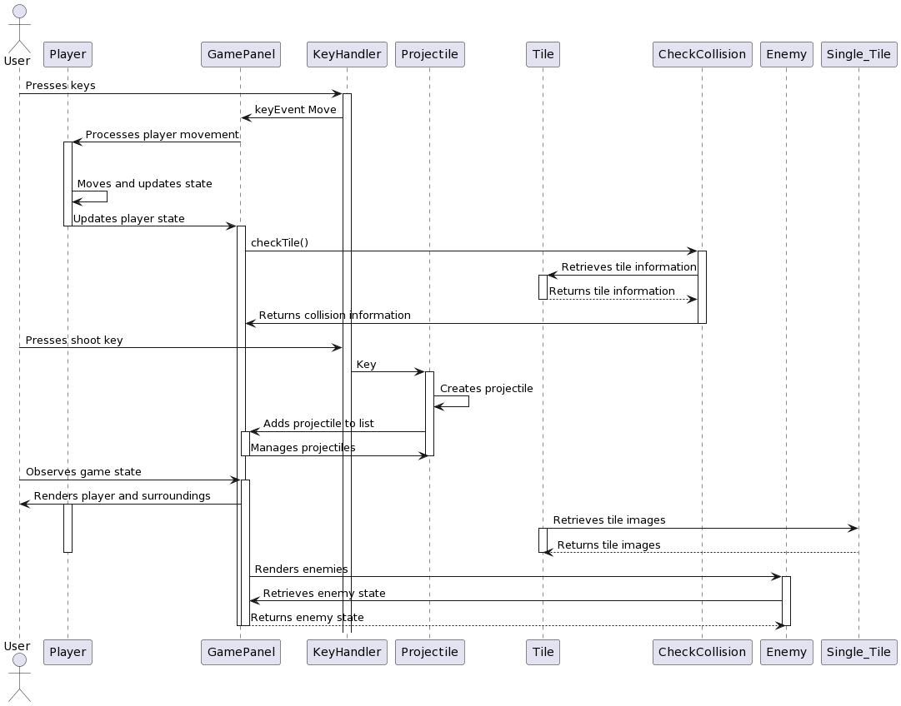

# Space Jam

A brief description of your game.

## Overview

- The game is a top down arcade style shooter
- Go around and kill enemies 
- Explore the rooms collect 4 keys in each room and use teleporters to switch rooms
- Collect 16 keys and escape by going back to where you originally spawned 
- Be careful, the longer you take, the more enemies will spawn

## Features

- **Player Movement:** Navigate through the game using WASD
- **Combat System:** Engage in combat with enemies using a sword or gun using [ENTER] and switch weapons with [SPACE].
- **Room Transitions:** Teleport between rooms using special tiles.
- **Kill Counter:** Keep track of your enemy kill count
- **Keys:** Unlock new rooms by collecting keys

**Not Yet Implemented:**

- **Advanced Enemy AI:** Enemies currently follow simple patterns; more complex AI is planned.
- **PowerUps:** Feature to play in different ways
- **BossRoom:** Boss room at the end of the game
- **Health:** Health drops on enemy death
- **Currency:** Money drop on enemy death and shop system
- **Merchant** With the currancy dropped you are allowed to buy more weapons and get better powers for the character
- **Enemies and Rooms** add more rooms and enemy types 

## How to Build and Play
1. Copy the url of the code in the repository
2. Import the url in Eclipse
3. Organize project structure. Ensure all classes are in the correct package and file paths.
4. Place the game assets (images, sounds) in the correct paths as specified in the code (e.g., "path/to/titleImage.png"). Make sure the asset file paths are correct.
5. Locate the MAIN class and run it
6. Play the game and HAVE FUN!!!

### Prerequisites

- JFrame

## Screenshots

*Caption for Screenshot 1*

*Caption for Screenshot 2*

## UML Class Diagram for files provided

## UML Sequence Diagram for files provided

